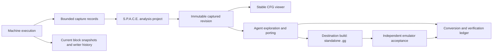

# S.P.A.C.E. block analysis and Game Boy → Game Gear porting design

Date: 2026-10-04 (America/Los_Angeles)

Status (2026-10-05): stages 1–5 are implemented. Stages 1–4 have user sign-off;
stage 5 has automated verification and user sign-off for viewer review and live tests.
The original assessment below is historical; sections 8–11 record implementation
and remaining scope. S.P.A.C.E.'s expanded name is intentionally undecided.

Source checkout: `fa4530752a698bc1ec82d567dbeb8207a3e49f9f`.
The tracked working tree was clean at the start of this assessment. `.internal/`
is ignored by the user's global Git ignore configuration, so this document is a
local planning artifact unless explicitly added to version control later.

## 1. Purpose and agreed decisions

T.I.M.E. began with a question: can an emulator record a repeated algorithm,
send it to a debugger/analyzer, and execute a more efficient equivalent?
S.P.A.C.E. is the proposed analysis component of T.I.M.E. The same evidence that
explains an algorithm should help a programmer or agent understand, modify, and
port a game.

The next product gate is an agent-assisted port of a small Game Boy homebrew to
a standalone `.gg` ROM that works in an independent Game Gear emulator. A third
core follows this proof. Host extensions may help exploration and intermediate
experiments, but the final ROM cannot depend on the T.I.M.E. host.

The agreed gate requires the standalone port and useful analysis. The user also
requires unresolved regions to block the label "complete." Whether a playable,
explicitly incomplete proof is sufficient to start a third core has not been
decided; this document does not silently impose or waive that additional gate.

Decisions established with the user:

- Start with the ROM. Use matching symbols, disassembly, or source when available.
- The agent performs adaptation; preserving gameplay while rewriting rendering
  and sound is acceptable.
- Preserve artwork, poses, and animation cadence; adapt screen layout as needed.
  Set gameplay and audio acceptance criteria for the selected game after analysis.
- Deliver useful analysis as well as a playable port. Identify routines and their
  relationships to graphics, sound, input, and other hardware interactions.
- Deliberately replaced code counts toward conversion when its replacement is
  documented. Unresolved regions block a complete result; incomplete ROMs may
  still be built and tested with an explicit incomplete label.
- Keep one current `MemorySnapshot` per analysis block, rather than a full
  snapshot per execution. It must be consistent with the active machine history.
- Resolve reads through the latest writer on that active history, and capture
  read values and their provenance.
- Persist exact-ROM-bound analysis and merge new discoveries across sessions.
- Checkpoint restoration restores execution state and writer ordering. Keep
  analysis discovered on abandoned branches, with its original provenance.
- Support both manual play and agent exploration, including checkpoint replay.
  The agent stops when it cannot reasonably resolve an obstacle and provides
  evidence, attempted approaches, and the smallest useful next question.
- Use a radare2-like control-flow graph. Inspect a stable captured revision while
  the emulator runs separately. Show observed facts separately from inferred
  meanings, with confirmation/correction available to the user.
- Show conversion progress on the graph. Track verification independently from
  conversion status.

Zilogized was suggested as a candidate. Its ROM, source availability, license,
hardware usage, and suitability have not been verified in this assessment.
Candidate selection remains open; another small homebrew is acceptable.

## 2. Current implementation trace

Paths below are relative to the repository root. Links resolve from this document.

### 2.1 Four distinct meanings of block

| Existing object | Current meaning | Relationship to the proposed graph |
| --- | --- | --- |
| [`fetchBlock`](../../inst_cycle/fetch/fetchBlock.hpp) | Base address plus entries containing offsets and raw instruction bytes. Game Boy's ordinary fetch creates one instruction entry. | Evidence input, not a persistent CFG node. |
| [`executionBlock`](../../inst_cycle/execute/executionBlock.hpp) | In-process `std::function` steps, cycle charges, and a borrowed `IMemory*` called `snapshot`. | Executable callbacks, not portable persisted analysis. The pointer can refer to a live pool. |
| `Executor::Segment` / `PluginExecutor::Segment` | Ordered vectors of fetched blocks, split by a predicate/policy. | Execution-order segments, not deduplicated CFG nodes or edge records. |
| `AnalysisBlock` (proposed) | ROM/mapping/code-version identity, instruction range, edges, evidence, and one current snapshot. | Persistent node inspected by S.P.A.C.E. |

Do not conflate these objects just because each uses the word block.

### 2.2 Recording and playback

[`Executor.hpp`](../../inst_cycle/executor/Executor.hpp) fetches from
`RuntimeContext` unless playback bytes are available, calls `context.step(fb)`,
then appends the fetched block when recording is enabled. A segment split happens
after appending its terminal block. With no predicate, it does not split.

[`PluginExecutor.hpp`](../../inst_cycle/executor/PluginExecutor.hpp) follows the
same pattern but delegates recording/splitting to the attached policy.
[`DefaultStepPolicy`](../../inst_cycle/executor/PluginContract.hpp) records and
splits on `feedback.segmentBoundaryHint`. Game Boy canonical execution sets that
hint from the control-flow opcode classification.

Neither recorder associates a snapshot with each recorded segment, stores a CFG,
tracks memory-read origins, or deduplicates repeated visits. The recording vectors
grow with executions. A recorded trace does not discover unexecuted paths.

[`BlockScript.hpp`](../../inst_cycle/executor/BlockScript.hpp) saves
`TIME_EXECUTOR_BLOCKS_V1`, segment markers, base addresses, entry offsets, and
instruction bytes. Loading flattens blocks into sequential playback; a loaded
block bypasses fetching and is decoded/executed against the supplied context.
This is byte playback, not input/checkpoint replay or a persistent analysis merge.
It stores no ROM hash, bank identity, snapshot association, read/write provenance,
CFG edges, or semantic annotations. Do not treat this format as S.P.A.C.E.'s
project format or as proof that the loaded bytes match the running ROM.

### 2.3 Actual machine execution

The frontend loop in [`emulator.cpp`](../../emulator.cpp) calls
`machine.runSlice(...)`. [`Machine::runSlice`](../../machine/Machine.hpp) wraps
retirement so the machine's device/event work runs before the optional retirement
observer. [`RuntimeContext::runSlice`](../../machine/RuntimeContext.hpp) steps
instructions and calls that sink. The normal frontend path does not construct
either of the recording executor wrappers above.

[`GameBoyRuntimeContext`](../../cores/gameboy/GameBoyMachine.cpp) fetches and
decodes through the CPU, with cached/IR/fast paths controlled by the execution
policy. In [`LR3592_DMG::decodeInto`](../../cores/gameboy/gameboy.cpp),
`block.setSnapshot(&mem)` binds callbacks to the CPU's live `MemoryPool`.
`execute` runs the callbacks and handles PC advancement, cycle charges, and
retirement. The register helpers `getMemoryPool`, `getRegister`, and
`getRegisterPair` downcast `IMemory` to `MemoryPool`; cached CPU register pointers
also refer to live state. `IMemory` itself exposes only memory reads and writes.

Consequently, replacing this pointer with a `MemorySnapshot` is insufficient:
the register access contract and CPU bookkeeping need an explicit execution-view
boundary. Device advancement and interrupt/DMA behavior must still remain owned
by the machine.

The older [`LR3592_Interpreter_Decode`](../../cores/gameboy/decode/gb_interpreter.cpp)
does accept a snapshot, copies registers from the main file, and reads through
snapshot memory. It is compiled into the core by `CMakeLists.txt`, but searches
found its snapshot setter only in its declaration/definition, with no installation
call in the current production sources inspected. The active decode path uses
the opcode table in `gameboy.cpp`. Treat the older helper as historical design
evidence, not proof of integrated snapshot execution.

[`GameGearRuntimeContext`](../../cores/gamegear/GameGearMachine.cpp) has a
different compatibility surface: `fetch()` exposes one opcode byte, `decode()`
returns an empty execution block, and `step(FetchBlock&)` steps the Z80 directly.
Its ordinary `step()` currently leaves `isControlFlow` and `segmentBoundaryHint`
false. A fetch observer exists on the Z80, but that alone is not a complete
instruction/operand/control-flow capture contract. The Game Boy recorder cannot
be assumed to produce an equivalent Game Gear CFG without further work.

### 2.4 Sparse snapshots

[`MemorySnapshot.hpp`](../../memory/MemorySnapshot/MemorySnapshot.hpp) contains
`RegisterFile file` and `SnapshotStorage mem`. Its implementation forwards memory
reads/writes and supports explicit copying of individual registers.

[`SnapshotStorage`](../../memory/MemorySnapshot/SnapshotStorage/SnapshotStorage.h)
holds a backing `MemoryStorage&`, address/offset pool metadata, and packed raw
data. Its [span-based `read`](../../memory/MemorySnapshot/SnapshotStorage/impl/SnapshotStorage.impl.hpp)
reads captured bytes locally and missing bytes from the backing store. A span
read does not add those bytes to the snapshot or record their supplier. Writes
populate the sparse overlay without updating the backing store.

There is no active-history writer index, snapshot chain, or read provenance in
these classes. Local bytes win even if another block wrote a newer value.
Register copying is explicit rather than a record of every register read/write.

The [`Proxy`](../../memory/MemorySnapshot/SnapshotStorage/impl/subclass/Proxy.hpp)
has different semantics: converting an absent address to a reference returns its
static default rather than reading the backing store. Reference-returning access
also cannot reliably observe later mutations through a retained reference.
An execution access layer must use explicit observed reads/writes, not assume
all existing access forms provide the span-read contract.

### 2.5 Persistence and checkpoints

[`DebugSnapshotManager.hpp`](../../memory/DebugSnapshotManager.hpp) saves a binary
`SNAP` v1 file containing core identity, register records, sparse pool metadata,
access permissions, and raw data. `load_snapshot` returns reconstructed storage
and register records; `load_from_disk` returns only storage. This is not a
reconstructed `MemorySnapshot` with its original fallback store, nor a complete
machine checkpoint. Serialization uses native representations; a new portable
analysis format needs explicit encoding rather than assuming this is universal.

The snapshot format contains no ROM hash, block identity, history/branch identity,
writer sequence, or dependency records. A persisted sparse overlay alone cannot
reproduce uncaptured values from its original backing state.

Game Boy [`save_state/load_state`](../../cores/gameboy/GameBoyMachine.cpp) are
separate full-machine facilities: CPU, memory, devices, mapper/cartridge, input,
and machine bookkeeping are serialized into chunks. They check core/ROM identity
(the current ROM identity is CRC32), and successful restore advances observation
generation. Active native trampolines reject save/load. These are foundations for
exploration checkpoints, but they do not save/restore S.P.A.C.E.'s writer history
or per-block snapshots. A project-wide exact-ROM identity should use a stronger
digest, proposed SHA-256, without silently changing existing save-state formats.

[`DebugSnapshotService`](../../machine/DebugSnapshotService.hpp) delivers bounded
video/audio debug snapshots to consumers. It is not the per-block memory manager.
Existing selected `MemoryWriteObserved` events and I/O descriptors are useful
navigation evidence, not exhaustive memory/register/port tracing. In particular,
the Game Boy write observer emits only selected hardware events; the Game Gear
descriptor table includes an APU-shaped address range, so descriptors need an
accuracy audit before being treated as a hardware classification authority.

### 2.6 IR is not destination-ROM generation

[`IrExecutionService`](../../inst_cycle/IrExecutionService.hpp) validates/lowers
source-machine instruction blocks and dispatches supported backends against a
host. The [multi-core IR decision](proto-time-phase-12-multi-core-ir-il.md)
preserves instruction retirement and machine ownership. It does not implement
Game Boy hardware adaptation, a Z80 ROM code generator/linker, or a standalone
Game Gear port pipeline. Unsupported IR instructions can execute in the original
interpreter; a standalone `.gg` cannot rely on that host fallback.

Existing Game Boy native/backend expansion restrictions remain in force. This
analysis/porting design does not authorize a new live optimizer or JIT.

## 3. Proposed data and ownership model

The following component names are proposals, not existing classes:

| Component | Responsibility |
| --- | --- |
| `AnalysisProject` | Exact ROM/core identity, imported symbols/source identities, schema version, discovery revisions, annotations, conversion evidence. |
| `AnalysisBlock` | Start and terminal instruction locations, ordered bytes/instructions, incoming/outgoing edges, code revision, snapshot handle. |
| `BlockSnapshotManager` | One current snapshot per block, current-history writer index, execution-view access and coherence. |
| `ExecutionHistory` | Branch/checkpoint identity, monotonic write/visit ordering, restore metadata. |
| `DependencyRecord` | Read/write location, value/width, instruction, supplying writer or device origin, history and execution sequence. |
| `AnalysisRevision` | Owned immutable captured graph/evidence viewed by UI and agent. |
| `ConversionLedger` | Source-to-target/replacement relationships, unresolved obligations, independent verification evidence. |
| `ConversionCompletenessChecker` | Reports explicit unresolved obligations and scope; never equates trace coverage with a universal proof. |

The emulation lane remains the single writer of guest state and live snapshot
metadata. S.P.A.C.E. analysis and file I/O consume owned records outside that lane.
The graph UI owns its stable capture, not references into live guest state.
Checkpoint/control requests are applied at machine-safe boundaries.

The configured graph MCP was unavailable in this session; runtime-path tracing
used direct current source. This ownership proposal follows the installed
Proto-Time concurrency guidance and the [current philosophy](../../docs/philosophy.md).

### 3.1 Identity and CFG construction

A CPU address alone is insufficient. Record ROM digest, core, address space,
physical bank/backing location where resolvable, logical address, mapping context,
and code bytes/version. RAM-generated or modified code requires a separate code
identity. Do not duplicate identical nodes merely because a session epoch changes;
epochs belong to execution provenance.

End a block at control flow; discover entry points from reset/interrupt vectors,
observed transfers, and static decoding. Record taken and not-taken edges,
fallthrough, calls, returns, and unresolved indirect destinations. Interrupt entry
and HALT/DMA/stall events must not be misidentified as normal instruction bytes.
Split an existing block when a new valid entry lands inside it. Preserve evidence
and flag affected conversion/verification records for review after splitting.

Static decoding and dynamic exploration complement each other. Data may resemble
instructions. Record classification evidence and ambiguity rather than declaring
every byte executable or declaring unvisited bytes irrelevant.

### 3.2 One snapshot per block and latest-writer reads

Each block retains one current sparse register/memory view, refreshed or
invalidated against the active history when re-entered. That view represents its
latest visit at a declared sequence; inactive block snapshots may have older
stamps and cannot be used as globally current state without validation.

Reads resolve the active history's latest valid writer first. A local captured
read is not itself a write. Track read captures separately from written bytes so
capturing a dependency cannot incorrectly seize ownership of an address.

Example: A writes `x=1`; B writes `x=2`; A runs again. A must read B's `2`, record
B as supplier, and refresh its captured value. A's retained `1` cannot override
the writer index. If A then writes `x=3`, it becomes the latest writer.

Each provenance reference includes a writer visit/sequence, not only block ID.
When A runs again and replaces its current snapshot, older analysis records must
still retain the values/evidence needed to explain earlier reads. Store compact
dependency evidence; do not retain a full snapshot for every visit by default.
Register aliases (A/F versus AF, etc.) need consistent lane/bit ownership.

Re-entry must also preserve any bytes for which the block is still the active
latest writer, even if the new visit does not touch them. Either retain those
owned writes in its snapshot with individual sequence stamps, or materialize
them in an authoritative history backing store before refreshing the block view.
The writer index must never point at a discarded or overwritten supplier value.

Memory-mapped I/O, port I/O, timers, DMA, and device-owned values cannot be treated
as ordinary cached RAM. An actual guest bus read must reach the authoritative
device exactly once, preserving side effects/timing, and record the returned
value with device provenance. Device writes and DMA updates must update or
invalidate the relevant history metadata. This needs a resolved address-space
and access-kind contract, not just an address/value pair.

Stage integration conservatively: first observe the baseline and build coherent
shadow snapshots, then introduce snapshot-backed execution for supported RAM/
register accesses only after differential tests pass. Shadow observation alone
does not fulfill the user's snapshot-backed execution objective. All guest
effects still reach the machine once; never execute on a shadow and then replay
its side-effectful I/O to commit it.

### 3.3 Checkpoints and persistent discovery

A checkpoint pairs full machine state with the active history identifier, writer
index, mapping context, and enough per-block snapshot data to restore every live
supplier. Sparse checkpoint copies or a journal are acceptable; this is not a
requirement to save every block execution indefinitely.

Restore the machine and matching snapshot/history metadata as one coordinated
operation. Reject mismatched/partial checkpoint sets. Start a new branch and
lifecycle epoch; keep prior analysis evidence labeled with its originating
branch. That evidence remains useful for analysis but cannot supply current reads.

Persist analysis separately from resumable machine state. Importing a project
merges observations/edges/annotations for the exact ROM; it does not silently
restore execution. Associate IDs and revisions with evidence, deduplicate merge
inputs, and preserve conflicting interpretations for review. Mismatched ROMs
require an explicit migration process. File loading validates sizes, offsets,
references, digests, and schema before publishing a complete new revision.

## 4. S.P.A.C.E. analysis and graph experience

V1 establishes instruction boundaries, CFG edges, register/memory accesses,
read origins, stable project identity, and save/reload/merge. V2 adds loop
classification and richer routine-purpose inference. Hardware access facts can
already be exposed in v1 without claiming a complete semantic analyzer.

For each purpose annotation, show:

- Observed fact: a block writes particular graphics-memory locations or ports.
- Static fact: a decoded branch targets a particular banked location.
- Inference: the routine probably uploads player animation tiles.
- User decision: confirmed/corrected interpretation, with original evidence retained.

Inference follows callers, inputs, data movement, and hardware interactions;
writing video memory alone does not prove that a routine draws the player.
Symbols/source are additional evidence whose correspondence to the ROM must be
checked. Purpose analysis runs in S.P.A.C.E.; an agent can query and annotate its
results, but is not a substitute for the proposed analysis component.

The main view is a radare2-like CFG with instruction text inside block nodes,
labeled branch edges, zoom/pan, search, and a selected-block inspector. The
inspector exposes current captured state, dependencies, evidence, interpretations,
target mapping, and verification records. Unknown destinations remain visible.

The displayed revision remains stable while emulation continues. Explicitly
loading a newer revision, while preserving layout/selection where possible, is
a recommendation rather than a user-approved refresh policy. Layout and UI
technology are implementation choices still open. Never label the capture live.

Use labels and shapes as well as colors to distinguish conversion and verification.
Conversion and verification are independent axes:

| Axis | Proposed states |
| --- | --- |
| Conversion | Unresolved, analyzed/unconverted, translated, deliberately replaced. |
| Verification | Not tested, passed for declared scope, failed, stale. |

Each translation/replacement links original blocks to target routines/artifacts,
records its rationale and behavioral contract, and identifies the target build
hash. Many source blocks may map to one replacement and vice versa. Build/code/
contract changes invalidate dependent verification instead of retaining a pass.

## 5. Completeness, exploration, and porting gate

Maintain a ROM-region inventory of code, data/assets, justified unused/padding,
and unresolved/ambiguous regions. Data needs asset/storage accounting even though
it is not executable code. Do not silently discard unknown bytes to improve a
coverage percentage. Imports and dynamic visits augment the inventory.

The completeness checker requires every identified executable region to have a
translation or documented replacement, every hardware dependency to have a
target implementation, and all unresolved region/control-flow/code-generation
obligations to be closed. Analyst judgments about unused regions require recorded
evidence and review; annotations alone are not proof.

Report these outcomes separately:

1. Conversion accounting is complete/incomplete for the declared ROM and analysis
   assumptions. Trace-only exploration cannot prove universal reachability.
2. Behavioral verification passed/failed/not-run for named scenarios and contracts.
3. Independent-emulator acceptance passed/failed/not-run for an exact target ROM.

If the selected ROM's reachable code cannot be bounded convincingly, the checker
must retain an incomplete outcome. A playable build may still be delivered with
that status. A complete result cannot be earned from instruction coverage alone.

Manual and automatic exploration share controls, checkpoints, and input evidence.
The agent records exploration attempts and new coverage, branches from checkpoints,
and targets unresolved edges/scenarios. Bound exploration work and stop on lack of
reasonable progress. Report the unresolved location, attempted methods, evidence,
impact on the gate, and smallest useful next experiment or user question. Exact
retry/time budgets remain an implementation choice.

The first proof delivers:

- Original ROM digest and matching supplemental sources, if used.
- Reloadable S.P.A.C.E. project and navigable captured CFG.
- Routine/hardware analysis and source-to-target/replacement ledger.
- Reproducible destination source/assets/build procedure and standalone `.gg`.
- Gameplay scenarios appropriate to the selected homebrew, plus artwork, poses,
  animation cadence, adapted layout, and explicitly chosen audio criteria.
- Independent emulator identity/version, ROM hash, test steps, and captured results.
- Explicit unresolved items, conversion outcome, and verification limitations.

The original and target need not have equal hardware registers or framebuffers.
Compare preserved gameplay quantities via explicit mappings and use presentation/
audio-specific checks for replacements. No particular Game Boy channel-to-Game
Gear channel mapping or voice requirement is assumed before inspecting the game.

## 6. Concrete gap assessment and implementation order

| Area | Current reusable foundation | Missing work / first acceptance condition |
| --- | --- | --- |
| CFG | Fetched bytes, control-flow feedback, segment predicates. | Bank-aware identities, decoded edges, node deduplication/splitting, unknown-target inventory. A loop revisits one node; a jump into its middle splits correctly. |
| Capture wiring | Machine retirement observer, memory map write hook, Z80 fetch observer. | Complete access/retirement association on actual machine stepping; full bytes and registers/ports; stalls/interrupt attribution; explicit trace-loss reporting. |
| Sparse state | `MemorySnapshot`, packed `SnapshotStorage`, explicit register copy. | Read capture, per-block lifecycle, write ownership, alias handling, A→B→A coherence, device provenance. |
| Snapshot execution | `executionBlock` accepts `IMemory*`; older snapshot decoder helpers exist. | Abstract register/execution access away from live-pool casts and cached pointers; integrate without changing guest device/timing semantics. |
| Persistence | Block-script and binary snapshot serializers. | Exact-ROM project schema, block/snapshot/history links, bank identity, deterministic merge, explicit encoding and transactional validation. |
| Exploration | Full machine save/load and input abstractions. | Coordinated metadata checkpoints, input replay/branch controller, automatic exploration and stuck reports. |
| Purpose analysis | Selected I/O events, visual resource observation, debug views. | Complete hardware interaction facts and dependency traversal; evidence-backed routine annotations; correct cross-core descriptors. |
| Graph UI | Existing emulator/debug presentation contracts. | Dedicated stable captured CFG and inspector; agent query access to the same revision. |
| Conversion ledger | Shared IR contracts and checked mod patches. | Source-to-destination mappings, replacement contracts, separate verification/invalidation, completeness checker. |
| Standalone port | Game Gear execution core can help internal tests. | Destination toolchain/code/assets, hardware adaptation and `.gg` generation; independent emulator proof. |

Proposed stages, with no runtime changes authorized by this document alone:

1. Establish bank-aware Game Boy capture on the real machine path; build/persist
   a CFG and shadow snapshots. Show a small captured graph and reload/merge it.
2. Implement active-history read provenance and coordinated checkpoints. Cover
   repeated blocks, aliasing, device updates, restore, and analysis retention.
3. Integrate snapshot-backed execution behind an explicit mode. Differentially
   validate guest state, effects, interrupts, and timing before wider adoption.
4. Add evidence-backed purpose analysis and exploration/query controls; expose
   stable revisions to the graph and agent. Loop inference is a v2 enrichment.
5. Add conversion/replacement accounting and independent verification records.
   Produce the homebrew Game Boy → Game Gear ROM and acceptance report.
6. Reassess third-core work only after the agreed standalone-port proof.

These stages do not promise automatic whole-program translation or a live
optimization pipeline. Those use the evidence model later and need their own
design/measurement decisions.

Stage 3 is proposed to support the chosen homebrew's needed RAM/register accesses,
with device access remaining authoritative. General support beyond that game's
requirements is not proposed as a prerequisite to its standalone port. Any
unsupported snapshot-execution case must be reported explicitly and handled by
a declared baseline mode rather than being called snapshot-backed execution.

## 7. Validation and remaining choices

Current-source inspection covered the files linked above, recorder call sites,
snapshot usages, CMake registrations, and the relevant tests. Existing smoke
tests establish sparse-overlay isolation, register-copy isolation, limited
snapshot persistence/validation, and fetched-byte recording/playback. They do
not test the missing S.P.A.C.E. facilities.

Focused validation for this assessment: rebuilt `time-smoke-snapshot`,
`time-smoke-register-snapshot`, `time-smoke-executor`, and
`time-smoke-plugin-executor`, then ran their four CTest entries: **4/4 passed**.
The complete suite was not run for this documentation-only change. No source
behavior changed; no live graph,
exploration, independent Game Gear port, or optimization acceptance was performed.

Required future regression scenarios:

- A→B→A latest-writer reads; captured reads never become writes.
- Repeated loop visits retain one current snapshot but preserve dependency evidence.
- Checkpoint restore removes abandoned writer state and keeps tagged discoveries.
- Bank switches, aliasing, mid-block entries, code changes, and unresolved jumps.
- Exactly-once MMIO/port reads/writes, device updates/DMA, interrupts and stalls.
- Snapshot-backed versus baseline state/effect/cycle comparisons.
- Wrong-ROM imports, corrupt/oversized projects, duplicate merges, and schema mismatch.
- Trace loss leaves an explicit gap; no completeness claim survives missing evidence.
- Translated and replaced nodes each have independent verification states;
  changing target code marks old results stale.
- Fixed graph capture does not mutate when newer analysis is published.
- Standalone `.gg` scenarios in an independent emulator, separately from T.I.M.E.

Remaining choices: first homebrew and ROM revision; project encoding; graph UI
technology and refresh behavior; trace/resource budgets; checkpoint storage
strategy; routine-inference implementation; destination toolchain; scenario/audio
contracts; review requirements for static classification and unused regions.
Also resolve whether conversion-complete accounting is required for the
third-core gate or an explicitly incomplete playable proof can be accepted.
These are explicit open choices, not blockers to this design assessment.

## 8. Stages 1–2 implementation update (2026-10-05)

Implemented in `space/`: baseline capture records and an 8,192-record SPSC
handoff, execution-driven bank/code-aware CFG construction, sparse captured block
views using `MemorySnapshot`, active-history writer/value metadata, dependency
provenance, versioned JSON persistence/merge, paired checkpoints, CLI exploration,
and an offline HTML graph/inspector with user annotations.

The Game Boy machine and memory map now expose internal capture hooks without
changing plugin ABIs. CPU state remains machine-owned. The analysis worker owns
shadow evidence and materializes one snapshot per block for a captured revision;
these shadow views never supply guest reads. This clarifies the earlier proposed
ownership split: the emulation lane owns guest state and produces ordered facts,
while the analysis component owns reconstructed shadow state.

Run `timeEmulator --space-project PATH` for manual-play capture, or `time-space
explore` for paused CLI/batch control. Captures reject accelerated executors and
native mods. Replacing ROM/boot ROM requires detaching capture; raw save-state
restore is rejected while capture is active to avoid inconsistent writer history.
Paired restore retains discoveries but restores checkpoint shadow state and
starts a new branch. Conversion/verification remain separately reserved and
unassessed, as stages 1–2 do not implement the ledger.

Remaining scope is unchanged: richer static ROM inventory and semantic purpose
analysis, automatic exploration, snapshot-backed guest execution, conversion
completeness/verification, and the independently runnable `.gg` proof. The graph
is observation-driven, not proof of all executable regions. Queue/resource gaps
are explicit. Project/source contracts and validation details are documented in
`space/README.md`; see `space-stages-1-2-validation.md` for measured results and
user-performed browser acceptance and manual-review sign-off (2026-10-05).

## 9. Stage 3 implementation update (2026-10-05)

`time-space explore --execution snapshot` now supplies supported CPU RAM/register
operations from emulation-owned execution snapshots. Baseline remains the default,
and the frontend remains baseline. `Execution` owns one current `MemorySnapshot`
per execution block plus compact supplier values. It is separate from the worker's
captured CFG views. ROM identity belongs to the session/checkpoint; runtime keys
include resolved backing/bank and fetched byte revisions. New interior entries
partition instruction ownership while supplier values survive independently.

The internal register execution adapter replaces opcode helpers' assumption that
all views are `MemoryPool`. Opcode execution binds AF/BC/DE/HL and SP/PC to the
active snapshot, publishes register values before bus effects/retirement, then
restores canonical bindings. WRAM, echo aliases and HRAM read from refreshed sparse
local storage. Reads do not become writers. RAM writes use the canonical path
once; unchanged writes still advance supplier ownership. Other memory reads use
the canonical bus/interceptor, preserving multi-byte span semantics. Instruction
fetch, interrupts, DMA, stalls and hardware retirement remain authoritative.

Execution preflight reserves storage before guest fetch effects. The shared
64 MiB budget conservatively charges 3 MiB supplier state and 512 KiB per block,
with a 2,048-instruction block limit. A potential new block is reserved on each
step and released when unused. Unsupported instruction backing/opcodes or budget
exhaustion pause before instruction effects. Lost capture evidence pauses at the
next completed boundary. Continuation requires an explicit baseline command;
stopped capture requires a fresh session to start complete evidence again.

CLI mode switches occur while paused. Snapshot activation seeds current canonical
state, never imported evidence. Status distinguishes requested/active mode and
pause reason, instruction/boundary counters, memory source counts and epoch.
Optional schema-1 dependency fields carry execution-source and epoch/block/write
stamps, shown in the inspector. Execution block IDs are separate from CFG IDs.

Checkpoint manifest v2 adds checksummed execution metadata. Save validates the
complete pair before publication. Restore validates on a disposable machine and
stages all metadata/storage before publishing machine and runtime history together;
new epochs retain old supplier stamps until later writes, and prior discoveries
remain. Requested modes must match. Legacy v1 checkpoints require baseline mode.
Project import remains analysis-only; plugin and `SNAP` formats are unchanged.

The fixture-first differential proof covers state/cycles and ordered effects,
including 252 supported base opcodes and all 256 CB operations. A sparse-storage
bug exposed by descending WRAM/HRAM accesses was repaired with sorted overwrite/
coalescing and bounded uncaptured gap reads. Usage and fixture commands live in
`space/README.md` and `tests/fixtures/space/execution-example.jsonl`. Automated
results and inspection boundaries are recorded in `space-stage-3-validation.md`.

Remaining stages: frontend snapshot acceptance, acceleration, routine-purpose
inference, automated exploration, conversion completeness/verification, and an
independently runnable Game Gear ROM. Stage 3 claims execution coherence for the
covered contracts, not speedup or whole-ROM conversion readiness.

## 10. Stage 4 implementation update (2026-10-05)

Implemented deterministic offline Game Boy hardware-role analysis in
`space/Analysis.*`. The analyzer consumes an immutable schema-1 capture on a
background lane. It never reads devices or supplies execution operands. Optional
access-origin and branch-stamped control-transfer records distinguish accepted
CPU effects, autonomous device updates, DMA and boundary events. Conditional
calls use observed taken outcomes rather than aggregate CFG call labels. Legacy
ambiguous origins remain unknown and cannot establish CPU-purpose findings.

Routine candidates start at capture roots, observed call/RST destinations and
interrupt entries. Ordinary branches and call continuations form candidate bodies;
callees remain separate. Shared membership, recursion and competing entry
boundaries are explicit. Direct hardware effects and effects reached through
observed callees are reported separately. Findings cite access/control evidence,
branches, rules and limitations. These are hardware-role explanations, not proof
of gameplay semantics. CGB-only controls in the DMG core remain unassessed facts.

Structural SCC cycles report members, entrances, exits and branch-scoped repeat
observations. Repeated CPU input reads can support polling; cycles do not prove
optimization safety. Decoded byte loads and unique supplier stamps establish copy
paths. Arithmetic, unsupported transformations, masked results, ambiguous
suppliers and bounded path length terminate chains. Equal values alone are
insufficient. Captured gaps, unresolved edges and unvisited alternatives remain
visible.

`time-space analyze` and `query` support offline operation. Exploration supports
`analyze`, `query`, `annotate` and `run_until`. Analyze explicitly replaces the
pinned capture; subsequent queries remain frozen while guest execution advances.
Queries are paginated (256 default, 1,024 maximum) and dependency traversal is
bounded (depth 2 default, 16 maximum). Instruction predicates stop before the
matching known backing/code identity; hardware predicates observe accepted CPU
accesses and stop after retirement, without a second device read. Bounds and
execution/evidence pauses are explicit in baseline and snapshot modes.

Analysis identity binds exact ROM/core, analyzer version, source revision and a
canonical evidence digest. Imports validate derived references and reject stale
analysis. Idempotent merges retain analysis; changed evidence discards it for
explicit recomputation. Stable instruction/routine-entry annotations can confirm
or correct findings while retaining original facts and generated interpretations.
Import remains analysis-only. Offline loading preserves history for round trips;
a new execution session explicitly starts fresh active history.

Analysis shares the 64 MiB resource limit. Work indexes and retained frozen storage
are accounted separately. Source preflight rejection preserves the old pin;
explicit replacement releases that pin before computing its successor. Exhausted
analysis produces an incomplete assessment with no partial findings. Queries and
capture observation are bounded independently of guest execution.

The offline viewer adds routine/role selection, cycle highlights, direct/callee
finding inspection, evidence navigation and finding-linked annotations. Explicit
loads verify the evidence digest and preserve surviving selections/layout.
`tests/fixtures/space/AnalysisFixture.hpp` and its Python generator provide a
separate authored fixture with tile copies, audio setup, input polling, shared
tails, recursion, conditional calls and interrupt routines; earlier fixtures are
unchanged. Usage is in `space/README.md`; measured validation and the browser
inspection limitation are in `space-stage-4-validation.md`.

Remaining work: gameplay-purpose interpretation beyond annotations, symbols/source
integration, model providers, automatic exploration, conversion/verification,
frontend snapshot acceptance, acceleration and independently runnable `.gg`
generation. Stage 4 establishes observed hardware-role evidence, not whole-ROM
coverage or porting readiness.

## 11. Stage 5 implementation update (2026-10-05)

The user completed stage-4 viewer presentation and manual acceptance and explicitly
signed off on both before committing stage 4. This supersedes the prior pending
human review in the stage-4 validation report.

Stage 5 adds independent optional version-1 port accounting to schema-1 projects,
implemented in `space/Porting.hpp/.cpp`. Full physical source-ROM inventories,
reviewed classification evidence, stable bank-aware instruction boundaries,
translations/replacements, target ranges, contracts, and hardware/control-flow
obligations are separate from observed hardware-purpose analysis. Unknown regions,
unreviewed evidence, unconverted code/data/header bytes, missing instruction
mappings and open obligations prevent accounting completion. FF padding is checked
against ROM bytes, with its unreachable status justified by the reviewed model.
Ordinary annotations never establish conversion completion.

The fixture-specific model permits fixed bank 0, gameplay banks 1/2 at address
4000, fixed trampolines with nested bank restoration, fixed VBlank interrupt entry,
nonrecursive bounded stack nesting, and ROM-only execution. It is an explicit
reviewed assumption set, not a trace-coverage proof or a general static verifier
for arbitrary cartridges. The completeness checker validates evidence structure,
references and artifact bytes; agent review provides classification/model closure.

The new authored source and target assemble independently with WLA-GB/WLA-Z80 and
WLA-Link into 64 KiB MBC1 and Sega-paged cartridges. Gameplay algorithm translations
are separate from target initialization, display, input, sound, interrupt and
mapper replacements. Canonical four-shade art is shared through encoding adapters.
Proof discovery starts from the exact Game Boy ROM; matched assembly, symbols and
assets are admitted afterward and recorded. Earlier fixtures remain unchanged.

A fixture capture driver attaches a fresh baseline S.P.A.C.E. session at each
paused window boundary, compares a separately executing untraced baseline at every
captured boundary, and merges discoveries without carrying active suppliers across
windows. Intentional omissions are persisted separately from capture gaps. Limits
are 16 windows, normally 32 steps (maximum 128), one million steps per trigger wait,
4096 scenario frames and 100 million total steps. Existing capture/state budgets,
snapshot explicit-pause behavior and execution plugin ABIs remain intact.

`time-space port init/import/check/record-verification` accepts structured files,
validates before atomic publication and never activates guest execution. Port
queries work on frozen schema-1 projects without requiring purpose analysis;
existing page limits remain in force. Conflicting ledgers/verification IDs are
rejected, matching imports are idempotent, and changed bindings mark prior checks
stale. Exact file mismatches fail artifact checks. The offline viewer shows
conversion overlays, inventory, mappings/replacements, contracts and separate
verification evidence. Revision replacement remains explicit.

The standalone libretro harness runs Gambatte and Genesis Plus GX in separate
processes and neither links nor imports T.I.M.E. execution code. Read-only RAM
probes compare committed logical game ticks; canonical artwork checks normalize
viewport and palette rank, and emitted audio is measured against cue contracts.
ROM/library hashes, core versions, scenarios, screenshots and audio are recorded.
Private output/config paths preserve user RetroArch settings. Full accounting,
behavioral verification, independent verification, live acceptance and viewer
review remain distinct. No headless run creates user acceptance.

Usage and artifact reproduction are documented in
`tests/fixtures/space/port-game/README.md` and `space/README.md`; validation is recorded
in `.internal/docs/space-stage-5-validation.md`. Automatic exploration, model
providers, general source integration/translation, frontend snapshot expansion,
acceleration and third-core implementation remain deferred.

Stage-5 acceptance update (2026-10-05): the user signed off on viewer review and
live tests and authorized committing the changes. Automated evidence and user
acceptance remain separately documented in the fixture validation report.
